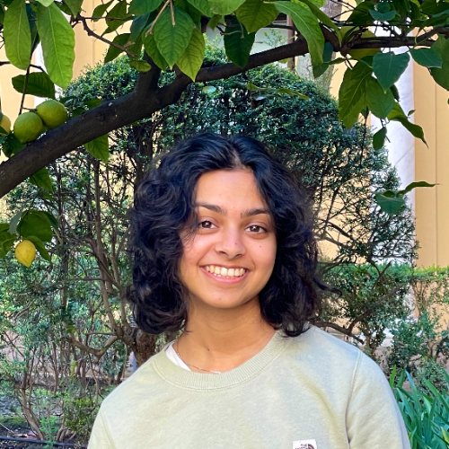

---
# Feel free to add content and custom Front Matter to this file.
# To modify the layout, see https://jekyllrb.com/docs/themes/#overriding-theme-defaults

layout: page
---

{: style="float: left; margin-right: 1em;"}

Hi! I'm Anya Agarwal, an incoming fourth year student at UC Berkeley studying computer science and design. 

I'm currently fascinated with the realm of computer graphics and front-end design — aka the intersection of art and software engineering. 

In my free time, you can find me exploring local coffee shops, 3D modeling/animating, playing tennis, or cultivating my farm in the game Stardew Valley.